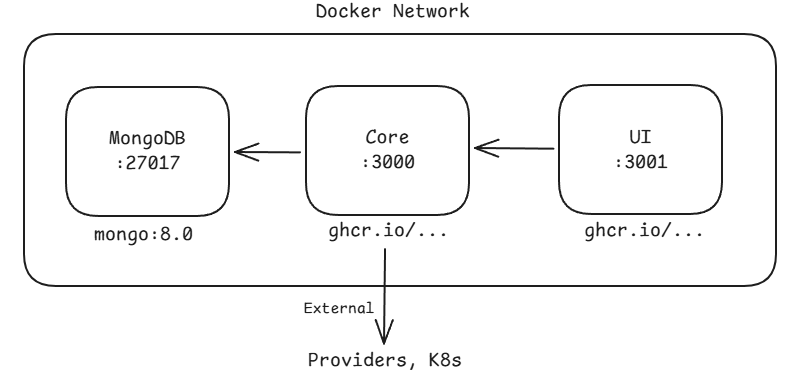
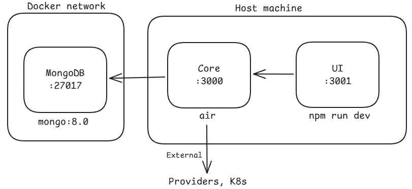
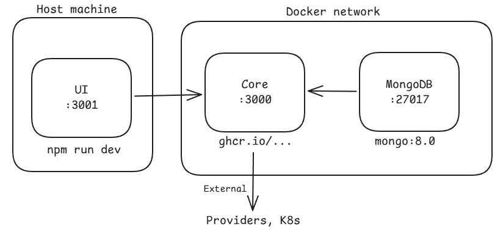
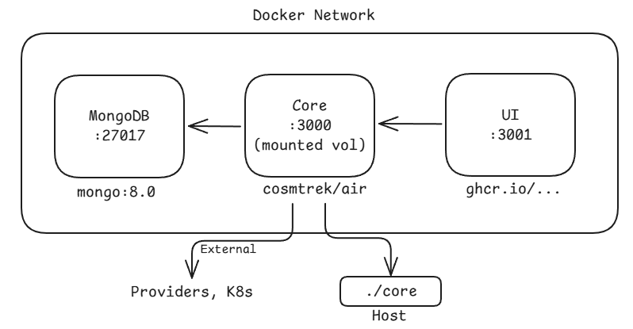

OrchCLI is a Go-based command-line tool that streamlines local development, testing, and contribution workflows for the KubeOrch platform. It manages Docker Compose environments, repository cloning, dependency installation, and service orchestration.

## Tech Stack

| Component | Technology |
|-----------|-----------|
| Language | Go 1.22+ |
| CLI Framework | Cobra |
| Config Locking | gofrs/flock |
| Distribution | NPM (`@kubeorch/cli`), Go install, shell script |
| Orchestration | Docker Compose |
| Database | MongoDB 8.0 (via Docker) |

## Project Structure

```
cli/
├── main.go                  # Entry point
├── cmd/                     # Cobra command definitions
│   ├── root.go              # Root command + version info
│   ├── init.go              # Initialize environment (clone repos, install deps)
│   ├── start.go             # Start services (auto-detects mode)
│   ├── stop.go              # Stop services
│   ├── restart.go           # Restart services
│   ├── logs.go              # View service logs
│   ├── status.go            # Check service health
│   ├── exec.go              # Execute commands in containers
│   ├── debug.go             # Debug network connectivity
│   ├── config.go            # Configuration management (file-locked JSON)
│   ├── concurrent.go        # Parallel task execution engine
│   ├── utils.go             # Docker Compose detection, helpers
│   └── testing.go           # Test utilities
│
├── docker/                  # Docker Compose files for each mode
│   ├── docker-compose.prod.yml         # All services in Docker
│   ├── docker-compose.dev.yml          # Only MongoDB in Docker
│   ├── docker-compose.hybrid-ui.yml    # MongoDB + Core in Docker
│   └── docker-compose.hybrid-core.yml  # All in Docker (Core with mounted code)
│
├── tests/                   # Test suites
│   ├── unit/                # Unit tests
│   ├── integration/         # Integration tests
│   └── mocks/               # Mock implementations
│
├── npm/                     # NPM distribution wrapper
│   └── scripts/
│       ├── postinstall.js   # Downloads Go binary on npm install
│       └── prepack.js       # Prepares npm package
│
├── install.sh               # Universal shell installer
├── package.json             # NPM package config (@kubeorch/cli)
├── go.mod                   # Go module definition
├── Makefile                 # Build targets
└── docs/                    # Internal architecture docs
```

## Installation

```bash
# Via shell script (recommended)
curl -sfL https://raw.githubusercontent.com/KubeOrch/cli/main/install.sh | sh

# Via NPM
npm install -g @kubeorch/cli

# Via Go
go install github.com/kubeorch/cli@latest

# From source
git clone https://github.com/KubeOrch/cli && cd cli && make install
```

## Command Reference

| Command | Description | Key Flags |
|---------|-------------|-----------|
| `orchcli init` | Initialize environment | `--fork-ui`, `--fork-core`, `--skip-deps` |
| `orchcli start` | Start services | `-d` (detached/background) |
| `orchcli stop` | Stop services | `-v` (remove volumes) |
| `orchcli restart [service]` | Restart services | Target: `ui`, `core`, `mongodb` |
| `orchcli logs [service]` | View logs | `-f` (follow), `--tail N` |
| `orchcli status` | Health check | Shows container + DB status |
| `orchcli exec <service> [cmd]` | Run command in container | Services: `postgres`, `core`, `ui` |
| `orchcli debug` | Debug connectivity | Tests networks, containers, DB |

## Development Modes

OrchCLI automatically selects the correct Docker Compose file based on which repositories are cloned locally. This is the core architectural concept.

### Production Mode

**When:** `orchcli init` (no flags)
**Compose file:** `docker-compose.prod.yml`

All three services run inside Docker using pre-built images from GHCR.



### Full Development Mode

**When:** `orchcli init --fork-ui --fork-core`
**Compose file:** `docker-compose.dev.yml` (MongoDB only)

Only MongoDB runs in Docker. UI and Core run on the host with hot reload.



### Frontend-Only Development

**When:** `orchcli init --fork-ui`
**Compose file:** `docker-compose.hybrid-ui.yml` (MongoDB + Core in Docker)

UI runs on host, backend services in Docker. Frontend devs don't need Go.



### Backend-Only Development

**When:** `orchcli init --fork-core`
**Compose file:** `docker-compose.hybrid-core.yml` (all Docker, Core with mounted code)

Everything runs in Docker, but the Core source code is volume-mounted for hot reload via Air. Backend devs don't need Go installed locally.



## Configuration System

OrchCLI stores project configuration in `~/.orchcli/orchcli-config.json` (or next to the binary). The config tracks multiple projects and uses file locking (`flock`) for safe concurrent access.

```json
{
  "projects": {
    "/path/to/project": {
      "path": "/path/to/project",
      "ui_path": "/path/to/project/ui",
      "core_path": "/path/to/project/core",
      "mode": "development"
    }
  },
  "current_project": "/path/to/project"
}
```

**Modes:** `production`, `development`, `ui-dev`, `core-dev`

The mode is auto-detected based on which repository paths are set and whether those directories exist on disk.

## Concurrent Operations

OrchCLI runs independent operations in parallel for speed:

- **Repository cloning** -- UI and Core repos cloned simultaneously
- **Dependency installation** -- `npm install` and `go mod download` run in parallel
- **Health checks** -- Multiple container checks run concurrently

Each concurrent task gets a progress indicator and errors are aggregated at the end.

## Auto-Installation

When `--auto-install` is enabled (default), OrchCLI automatically installs missing prerequisites:

| Dependency | Linux (Debian) | macOS |
|-----------|----------------|-------|
| Git | `apt-get install git` | `brew install git` |
| Node.js/npm | NodeSource LTS | `brew install node` |
| Go | `apt-get install golang-go` | `brew install go` |

Docker/Docker Compose must be installed manually as they require system-level setup.
