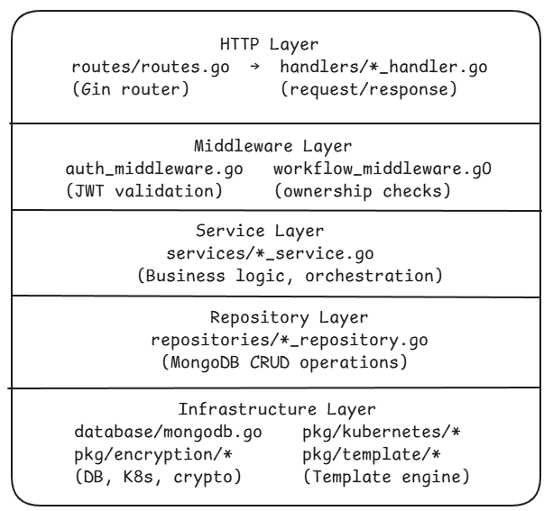

The core backend is a Go application built with the Gin web framework. It follows a layered architecture with clear separation between HTTP handlers, business logic services, data repositories, and infrastructure concerns.

## Project Structure

```
core/
├── main.go                    # Entry point - config, DB, router, graceful shutdown
├── config.yaml.example        # Configuration template
├── Dockerfile                 # Multi-stage Docker build
│
├── routes/
│   └── routes.go              # All API route definitions and middleware wiring
│
├── handlers/                  # HTTP request handlers (controllers)
│   ├── auth_handler.go        # Register, login, OAuth, profile
│   ├── workflow_handler.go    # CRUD + run + save workflows
│   ├── workflow_version_handler.go  # Version control operations
│   ├── cluster_handler.go     # Cluster CRUD + status + metrics
│   ├── build_handler.go       # Container image builds
│   ├── import_handler.go      # Docker Compose / Git import
│   ├── resources_handler.go   # K8s resource management + streaming
│   ├── registry_handler.go    # Container registry management
│   ├── plugin_handler.go      # CRD plugin management
│   ├── dashboard_handler.go   # Dashboard stats
│   ├── search_handler.go      # Global search
│   ├── settings_handler.go    # Admin settings (invite codes)
│   ├── diagnostics_handler.go # Node diagnostics and auto-fix
│   └── oauth_handler.go       # OAuth2/OIDC provider handlers
│
├── services/                  # Business logic layer
│   ├── auth_service.go        # Auth logic, JWT, password hashing
│   ├── workflow_service.go    # Workflow CRUD operations
│   ├── workflow_executor.go   # Workflow execution engine (nodes → K8s manifests)
│   ├── workflow_version_service.go  # Version control logic
│   ├── kubernetes_cluster_service.go # Cluster connection management
│   ├── cluster_health_monitor.go    # Background health checks (60s interval)
│   ├── build_service.go       # Nixpacks container image building
│   ├── import_service.go      # Import analysis and conversion
│   ├── docker_compose_parser.go     # Docker Compose file parsing
│   ├── git_service.go         # Git repository operations
│   ├── resource_service.go    # K8s resource tracking
│   ├── resource_watcher.go    # Real-time K8s resource monitoring
│   ├── resource_watcher_manager.go  # Manages multiple watchers
│   ├── resource_sync_monitor.go     # Periodic resource sync
│   ├── sse_broadcaster.go     # Unified SSE pub/sub system
│   ├── pod_log_stream_manager.go    # Pod log streaming
│   ├── registry_service.go    # Container registry operations
│   ├── plugin_service.go      # Plugin management
│   ├── search_service.go      # Cross-entity search
│   ├── user_service.go        # User management
│   ├── oauth_service.go       # OAuth2/OIDC flow handling
│   ├── dashboard_service.go   # Dashboard statistics
│   ├── layout_engine.go       # Auto-layout for imported nodes
│   ├── node_converter.go      # Import → workflow node conversion
│   ├── nixpacks_service.go    # Nixpacks build integration
│   ├── fix_templates.go       # Auto-fix templates for diagnostics
│   └── service_diagnostics.go # Service health diagnostics
│
├── models/                    # Data models (MongoDB documents)
│   ├── auth.go                # User, role definitions
│   ├── workflow.go            # Workflow, nodes, edges, versions, runs
│   ├── cluster.go             # Cluster, credentials, metadata
│   ├── build.go               # Build job definitions
│   ├── import.go              # Import analysis results
│   ├── import_session.go      # Async import session tracking
│   ├── resource.go            # Tracked K8s resources
│   ├── registry.go            # Container registry configs
│   ├── plugin.go              # Plugin definitions
│   ├── dashboard.go           # Dashboard stats snapshots
│   ├── cluster_metrics.go     # Cluster resource metrics
│   ├── oauth.go               # OAuth state and code models
│   └── user.go                # User model
│
├── repositories/              # Data access layer
│   ├── cluster_repository.go
│   ├── resource_repository.go
│   ├── registry_repository.go
│   ├── plugin_repository.go
│   ├── build_repository.go
│   └── import_repository.go
│
├── middleware/                # HTTP middleware
│   ├── auth_middleware.go     # JWT validation + admin check
│   ├── workflow_middleware.go # Workflow ownership verification
│   ├── logs_middleware.go     # Request/response logging
│   └── utils.go              # Middleware utilities
│
├── database/
│   └── mongodb.go             # MongoDB connection, collections, indexes
│
├── pkg/                       # Shared packages
│   ├── applier/
│   │   └── manifest_applier.go    # Applies K8s manifests to clusters
│   ├── encryption/
│   │   └── encryption.go          # AES-256-GCM credential encryption
│   ├── kubernetes/
│   │   ├── auth.go                # K8s auth config builders
│   │   ├── config.go              # K8s client configuration
│   │   └── connection.go          # K8s connection management
│   ├── template/
│   │   ├── engine.go              # Template rendering engine
│   │   └── registry.go            # Template registry (discovery + loading)
│   └── validator/
│       └── resource_validator.go  # Resource validation rules
│
├── templates/                 # Kubernetes resource templates
│   └── core/
│       ├── deployment/        # Deployment template + metadata
│       ├── service/           # Service template
│       ├── ingress/           # Ingress template
│       ├── configmap/         # ConfigMap template
│       ├── secret/            # Secret template
│       ├── statefulset/       # StatefulSet template
│       ├── job/               # Job template
│       ├── cronjob/           # CronJob template
│       ├── daemonset/         # DaemonSet template
│       ├── hpa/               # HPA template
│       ├── networkpolicy/     # NetworkPolicy template
│       └── persistentvolumeclaim/ # PVC template
│
└── utils/
    ├── config/
    │   └── config.go          # Viper-based configuration loading
    └── gravatar.go            # Gravatar URL generation
```

## Layered Architecture



The backend is organized into distinct horizontal layers. Each layer has a single responsibility and communicates only with the layers adjacent to it.

**HTTP Layer (`handlers/` + `middleware/`)** -- Gin route handlers receive incoming HTTP requests, extract and validate input from path parameters, query strings, and request bodies, then delegate all logic to the service layer. Handlers never touch MongoDB directly. Middleware runs before handlers to enforce authentication, authorization, and logging uniformly across route groups.

**Service Layer (`services/`)** -- All business logic lives here. Services orchestrate multi-step operations such as workflow execution, cluster health monitoring, and real-time resource watching. Services call repositories for persistence and call `pkg/` packages for infrastructure concerns like template rendering and manifest application. Services do not import handler packages.

**Repository Layer (`repositories/`)** -- Thin wrappers around MongoDB collection operations. Repositories translate between Go model structs and BSON documents, handle query construction, and manage indexes. They expose typed methods (`FindByID`, `Create`, `Update`, `Delete`) so the rest of the codebase never constructs raw MongoDB queries.

**Model Layer (`models/`)** -- Plain Go structs with BSON and JSON struct tags. Models define the shape of every document stored in MongoDB and every JSON response returned by the API. Keeping models in their own package prevents import cycles between services and repositories.

**Infrastructure Packages (`pkg/`)** -- Reusable, domain-agnostic packages that can be imported by any layer above them. `pkg/template` renders Go templates into Kubernetes YAML. `pkg/applier` sends manifests to the Kubernetes API server. `pkg/encryption` handles AES-256-GCM for credential storage. `pkg/kubernetes` manages client-go configuration and connection pooling.

## Startup Sequence

```
main.go
  ├── config.Load()                    # Load config.yaml + env vars via Viper
  ├── Validate auth configuration      # At least one auth method must be enabled
  ├── database.Connect()               # Connect to MongoDB, create indexes
  ├── template.InitializeGlobalRegistry()  # Load K8s resource templates
  ├── routes.SetupRouter()             # Configure Gin routes + middleware
  ├── ClusterHealthMonitor.Start()     # Start background health checks
  ├── GetSSEBroadcaster()              # Initialize SSE pub/sub system
  ├── srv.ListenAndServe()             # Start HTTP server
  └── Graceful Shutdown                # Stop watchers, SSE, health monitor, DB
```

Each step is sequential and blocking. A failure at any step before `ListenAndServe` causes the process to exit with a non-zero status code, preventing a partially initialized server from accepting traffic.

`config.Load()` uses Viper to merge `config.yaml` values with environment variable overrides. This means every configuration key can be set via environment variable, which is the standard approach in containerized deployments.

`database.Connect()` not only establishes the MongoDB connection but also creates all collection indexes on startup. Running index creation idempotently at startup ensures indexes are always present even after schema migrations or first deployment, without requiring a separate migration step.

`template.InitializeGlobalRegistry()` scans the `templates/core/` directory tree, reads every `metadata.yaml` file, and populates the in-memory `TemplateRegistry`. This is done before the router is set up so that template validation during request handling never needs to read from disk.

`routes.SetupRouter()` constructs the full Gin engine with all middleware groups and handler registrations. After this call returns, the server is fully configured but not yet accepting connections.

`ClusterHealthMonitor.Start()` launches the background goroutine that will run health checks every 60 seconds. Starting this before `ListenAndServe` ensures monitoring is active from the moment the first request is accepted.

## Graceful Shutdown

The server handles `SIGINT` and `SIGTERM` signals with ordered cleanup:

1. Stop all resource watchers
2. Close SSE broadcaster (disconnect all clients)
3. Stop health monitor
4. Shutdown HTTP server (10s deadline)
5. Close MongoDB connection

The shutdown order is deliberate. Resource watchers and the SSE broadcaster are stopped first because they hold open connections to the Kubernetes API server and to frontend clients respectively. Stopping them before the HTTP server shutdown means that in-flight SSE streams are terminated cleanly rather than being cut mid-stream. The health monitor is stopped next to prevent new MongoDB writes from interfering with the connection closure that follows.

The HTTP server is given a 10-second deadline via `context.WithTimeout` to allow in-flight HTTP requests to complete. Requests that do not finish within that window are forcibly terminated. Only after the HTTP server has shut down is the MongoDB connection closed, ensuring that any final writes (such as marking a running workflow run as cancelled) have a chance to complete before the database driver is torn down.
