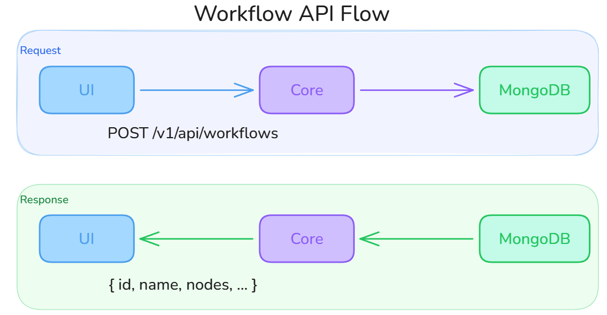
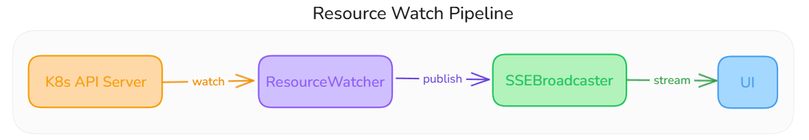
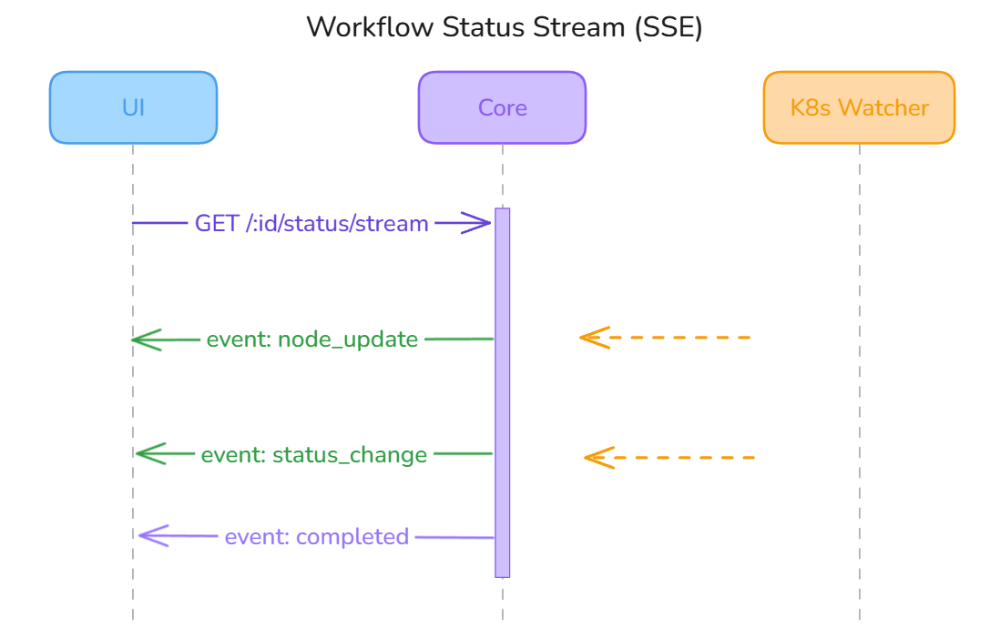
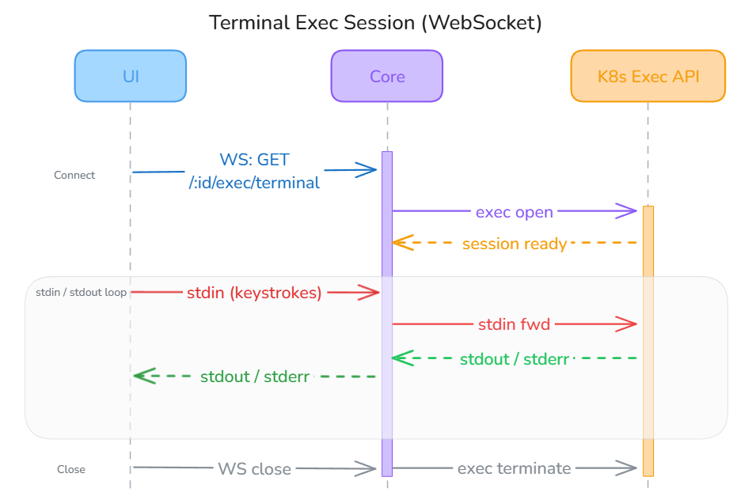
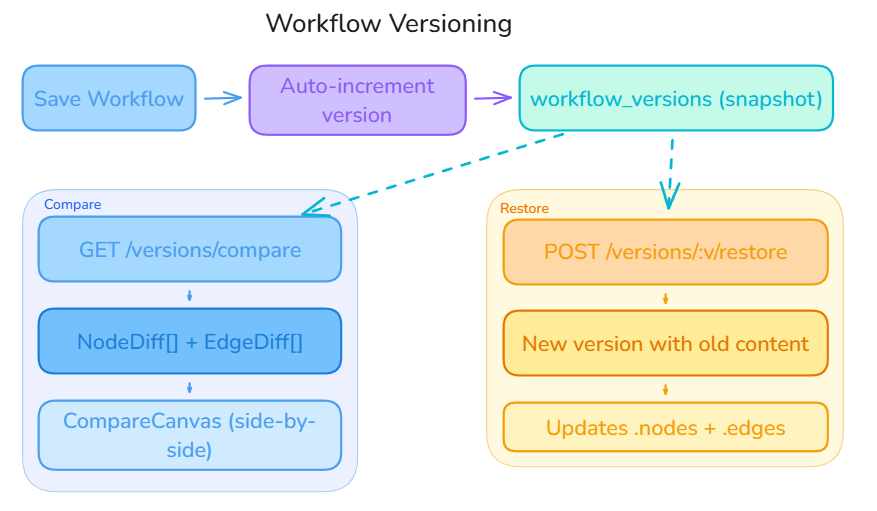

This page traces the data flow through the entire system for the most important user operations.

## Workflow Creation and Deployment

This is the primary flow -- a user creates a visual workflow and deploys it to Kubernetes.

The diagram below shows the round-trip for a workflow API call. The UI sends a `POST /v1/api/workflows` request (body: `name`, `description`, `cluster_id`) and receives back the full workflow document including its generated `id`, empty `nodes` and `edges` arrays, and initial `draft` status. All subsequent saves call `POST /v1/api/workflows/:id/save`, which sanitizes node data and detects any nodes removed since the last save so their Kubernetes resources can be cleaned up.

### Phase 1: Design

### Phase 2: Deploy

### Node-to-Manifest Transformation

Each visual node is converted to a Kubernetes manifest through the template system:

## Docker Compose Import Flow

Users can import existing Docker Compose files to auto-generate workflow nodes.

For Git repository imports, the flow includes an async step where the core clones the repo, detects the compose file, and streams progress via SSE.

## Container Build Flow

Users can build container images from Git repositories using Nixpacks.

Build status progresses: `pending → cloning → building → pushing → completed/failed`

## Authentication Flow

### Built-in Email/Password

1. User submits registration/login form
2. Core validates input and hashes password (bcrypt, cost 12)
3. If first user, automatically assigned admin role
4. User saved to MongoDB, JWT generated (24h expiry)
5. UI stores token in Zustand AuthStore (persisted to localStorage)
6. All subsequent requests include `Authorization: Bearer <token>`
7. Token refresh available via `POST /auth/refresh` (max 7 days)

### OAuth2/OIDC Flow

1. User clicks "Login with X" (GitHub, Authentik, etc.)
2. Core generates a state parameter and redirects to the provider's auth page
3. User consents, provider redirects back to Core with an authorization code
4. Core exchanges the code for an access token, then fetches user info from the provider
5. Core creates or links the user account in MongoDB
6. Core redirects to UI with a short-lived authorization code
7. UI exchanges the code for a JWT via `POST /auth/oauth/exchange`

## Real-Time Resource Monitoring

After deployment, the core maintains active watchers on Kubernetes resources:

### Resource Watch Pipeline

When a workflow is run, the Core's `StreamWorkflowStatusHandler` calls `startWatchersForWorkflow`, which creates a `ResourceWatcher` for every node in the workflow. Each watcher uses the Kubernetes dynamic client with a field selector targeting that specific resource by name and namespace.

The `ResourceWatcher` receives raw Kubernetes watch events and extracts a human-readable status using a type-specific extractor. For example, a Deployment watcher compares `readyReplicas` against the desired count, inspects ReplicaSet conditions, and surfaces pod-level failure messages. When the extracted status differs from the last known state, it:

1. Updates the `workflow_runs` document in MongoDB with the new node status
2. Publishes a `StreamEvent` to the `SSEBroadcaster` on `workflow:<id>` and `resource:<id>` keys

If the K8s API server watch connection drops, the watcher retries with exponential backoff (5s initial, 60s cap).

### SSE Status Stream

The UI opens a persistent SSE connection to `GET /v1/api/workflows/:id/status/stream` using `fetch()` with an `Authorization: Bearer` header (native `EventSource` is not used because it cannot send custom headers).

The Core's handler subscribes to the `SSEBroadcaster` under the `workflow:<id>` key and flushes events to the response writer. The broadcaster does a non-blocking fan-out — events are dropped for slow clients rather than blocking other subscribers. The UI `useWorkflowStatusStream` hook handles five event types:

| Event | Action |
|---|---|
| `metadata` | Confirms stream is live, hydrates initial node statuses |
| `node_update` | Updates a specific node's status on the canvas |
| `workflow_sync` | Syncs the full workflow state (used after reconnect) |
| `error` | Surfaces error message for the affected node |
| `complete` | Marks the workflow run as finished |

A global `activeConnections` Set prevents duplicate connections from React StrictMode double-mounts. On disconnect, the hook auto-reconnects after 3 seconds.

### Terminal Exec Session

Terminal access to pods uses a WebSocket connection for full-duplex stdin/stdout/stderr communication. The UI connects via `GET /v1/api/resources/:id/exec/terminal?shell=bash&token=<jwt>`.

The JWT is passed as a URL query parameter because browsers do not allow custom headers on WebSocket upgrades — this is a documented limitation with a planned fix to use a short-lived server-issued ticket instead. Once the handshake completes, the Core proxies the connection directly to the Kubernetes Exec API using `client-go`'s SPDY executor. The `useTerminal` hook in the UI handles four server message types: `metadata` (session ready), `output` (terminal bytes to display), `error` (session-level failure), and `close` (session ended by server or pod exit).

## Version Control Flow

Every time a workflow is run, the Core automatically increments the version counter and writes a complete snapshot of the current `nodes` and `edges` arrays into the `workflow_versions` collection. This happens atomically before the executor starts, so every deployment is always traceable to an exact version.

Each version snapshot contains the full node graph — not a delta — which keeps reads fast and avoids replay chains. Two operations branch off from any stored snapshot:

**Compare** (`GET /v1/api/workflows/:id/versions/compare?v1=1&v2=3`) — The Core loads both version snapshots and computes a `NodeDiff[]` and `EdgeDiff[]` by comparing node IDs, types, and data fields. The UI renders this in a side-by-side `CompareCanvas`, highlighting added nodes in green, removed nodes in red, and changed nodes in amber.

**Restore** (`POST /v1/api/workflows/:id/versions/:v/restore`) — Rather than overwriting the current workflow, the Core creates a *new* version whose content is a copy of the selected historical snapshot, then updates the live `workflow.nodes` and `workflow.edges`. This means the version history is always append-only and a restore can itself be undone.
