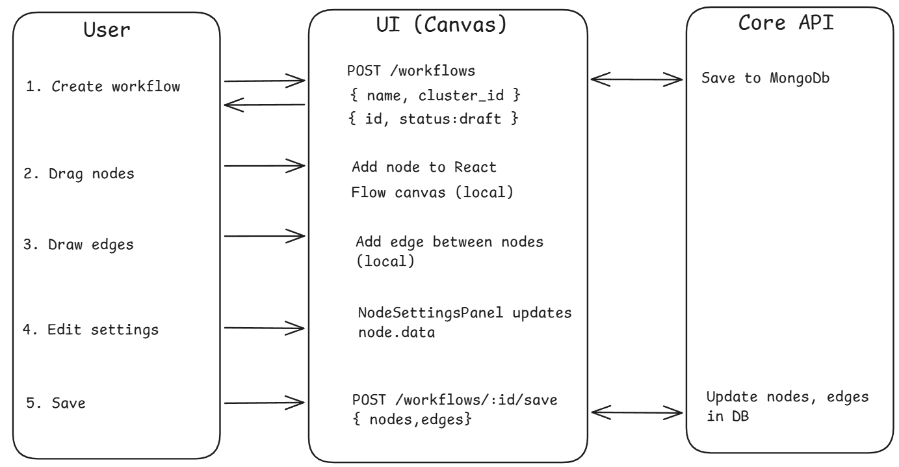
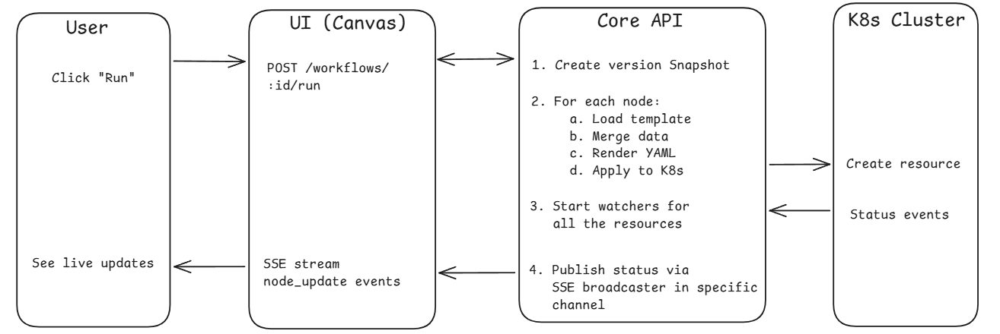
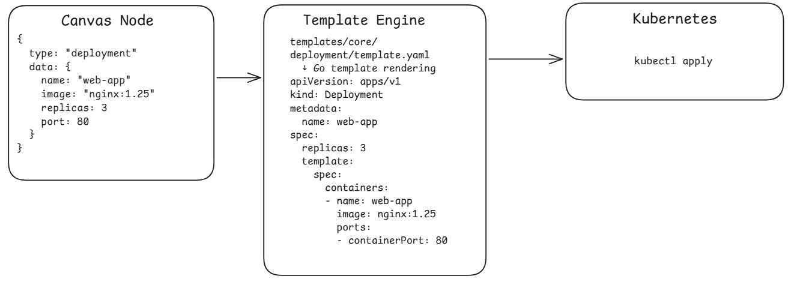
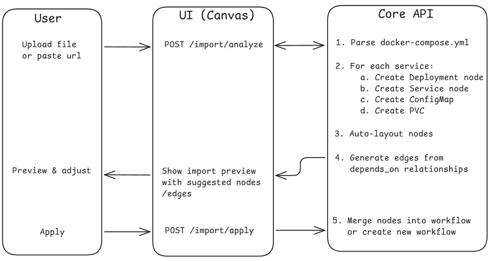
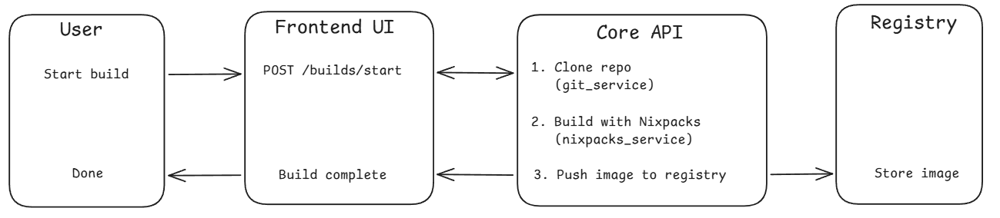
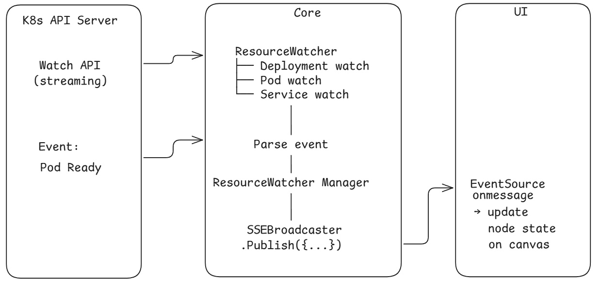

This page traces the data flow through the entire system for the most important user operations.

## Workflow Creation and Deployment

This is the primary flow -- a user creates a visual workflow and deploys it to Kubernetes.

### Phase 1: Design



### Phase 2: Deploy



### Node-to-Manifest Transformation

Each visual node is converted to a Kubernetes manifest through the template system:



## Docker Compose Import Flow

Users can import existing Docker Compose files to auto-generate workflow nodes.



For Git repository imports, the flow includes an async step where the core clones the repo, detects the compose file, and streams progress via SSE.

## Container Build Flow

Users can build container images from Git repositories using Nixpacks.



Build status progresses: `pending → cloning → building → pushing → completed/failed`

## Authentication Flow

### Built-in Email/Password

1. User submits registration/login form
2. Core validates input and hashes password (bcrypt, cost 12)
3. If first user, automatically assigned admin role
4. User saved to MongoDB, JWT generated (24h expiry)
5. UI stores token in Zustand AuthStore (persisted to localStorage)
6. All subsequent requests include `Authorization: Bearer <token>`
7. Token refresh available via `POST /auth/refresh` (max 7 days)

### OAuth2/OIDC Flow

1. User clicks "Login with X" (GitHub, Authentik, etc.)
2. Core generates a state parameter and redirects to the provider's auth page
3. User consents, provider redirects back to Core with an authorization code
4. Core exchanges the code for an access token, then fetches user info from the provider
5. Core creates or links the user account in MongoDB
6. Core redirects to UI with a short-lived authorization code
7. UI exchanges the code for a JWT via `POST /auth/oauth/exchange`

## Real-Time Resource Monitoring

After deployment, the core maintains active watchers on Kubernetes resources:



## Version Control Flow

Workflows support git-like versioning:

```
Save Workflow → Auto-increment version → Store snapshot in workflow_versions collection
                                          │
                                          ├── Compare: GET /versions/compare?v1=1&v2=3
                                          │   → Returns NodeDiff[] and EdgeDiff[]
                                          │   → UI shows side-by-side CompareCanvas
                                          │
                                          └── Restore: POST /versions/:v/restore
                                              → Creates new version with old content
                                              → Updates workflow.nodes and workflow.edges
```

Each version stores a complete snapshot of nodes and edges, enabling full rollback and diff comparison.
