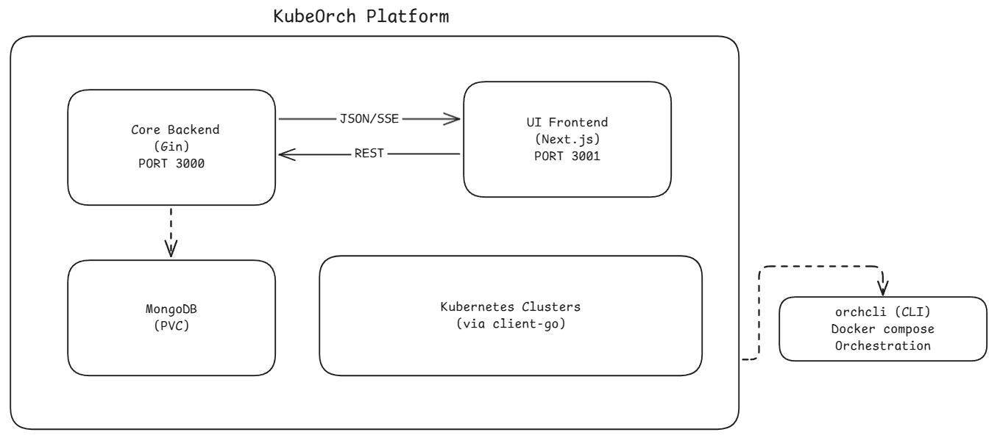

KubeOrch is a three-repo platform: a Go backend (core), a Next.js frontend (ui), and a developer CLI (cli), connected via REST APIs and Server-Sent Events (SSE) for real-time updates. The CLI orchestrates the local development environment using Docker Compose.

## System Architecture



## Component Responsibilities

### Core Backend (Go)

The backend is the brain of the platform. It:

- **Serves the REST API** on port 3000 under the `/v1` prefix
- **Manages Kubernetes clusters** -- stores encrypted credentials, tests connections, monitors health
- **Executes workflows** -- converts visual node graphs into Kubernetes manifests and applies them via `client-go`
- **Handles authentication** -- JWT-based auth with support for OAuth2/OIDC providers (GitHub, Authentik, etc.)
- **Streams real-time data** -- SSE broadcaster for workflow status, pod logs, resource status, build progress, and import progress
- **Builds container images** -- integrates with Nixpacks for source-to-image builds
- **Imports projects** -- parses Docker Compose files and Git repos into workflow node graphs
- **Manages templates** -- provides pre-configured resource templates for the component palette
- **Handles plugins** -- CRD-based extensible plugin system for custom resource types

### UI Frontend (Next.js)

The frontend provides the user experience. It:

- **Visual Workflow Canvas** -- React Flow-based drag-and-drop editor with 15+ node types
- **State Management** -- Zustand stores for auth, workflows, clusters, resources, plugins, and registries
- **API Client** -- Axios-based client with automatic JWT refresh and 401 redirect handling
- **Real-Time Streaming** -- SSE/EventSource hooks for live workflow status, pod logs, and build progress
- **Dashboard** -- Overview with stats, recent workflows, and cluster status
- **Settings & Admin** -- Cluster management, registry configuration, user profiles

### CLI (orchcli)

The CLI is the developer experience layer. It:

- **Initializes projects** -- clones UI/Core repos (or forks), installs dependencies concurrently
- **Manages Docker Compose** -- auto-selects the right compose file based on which repos are cloned locally
- **Supports 4 development modes** -- production (all Docker), full dev (both local), frontend-only, backend-only
- **Provides service management** -- start, stop, restart, logs, status, exec, and debug commands
- **Handles fork workflows** -- auto-configures upstream remotes for external contributors
- **Auto-installs dependencies** -- detects and installs Git, Node.js, and Go when needed

### Data Layer (MongoDB)

MongoDB stores all persistent data across these collections:

| Collection | Purpose |
|-----------|---------|
| `users` | User accounts, roles, OAuth provider links |
| `workflows` | Workflow definitions with nodes, edges, and metadata |
| `workflow_versions` | Version history for workflows (separate collection for scalability) |
| `workflow_runs` | Execution history and logs for each workflow run |
| `oauth_states` | Temporary OAuth flow state (TTL: 10 min) |
| `oauth_codes` | Temporary OAuth authorization codes (TTL: 30 sec) |
| `dashboard_stats` | Pre-computed dashboard statistics |

Additional data is stored in MongoDB via repository patterns:
- Clusters, resources, registries, plugins, builds, and import sessions

## Communication Patterns

### REST API (Request-Response)

All CRUD operations use standard REST over HTTP:

```
UI ──── POST /v1/api/workflows ────► Core ────► MongoDB
UI ◄─── { id, name, nodes, ... } ◄── Core ◄─── MongoDB
```

### SSE (Server-Sent Events)

Real-time updates use SSE streams. The core maintains a singleton `SSEBroadcaster` that manages subscriber channels per stream key:

```
UI ──── GET /v1/api/workflows/:id/status/stream ────► Core
UI ◄─── event: node_update                      ◄─── Core ◄── K8s Watcher
UI ◄─── event: status_change                    ◄─── Core ◄── K8s Watcher
UI ◄─── event: completed                        ◄─── Core
```

Stream types:
- `workflow:<id>` -- Workflow execution status and node-level updates
- `pod-logs:<id>` -- Live container log streaming
- `resource:<id>` -- Resource status changes from Kubernetes watchers
- `build:<id>` -- Container image build progress
- `import:<id>` -- Import session progress

### WebSocket

Terminal sessions use WebSocket for bidirectional communication:

```
UI ◄───► GET /v1/api/resources/:id/exec/terminal ◄───► Core ◄───► K8s Exec API
```

## Authentication Flow

```
1. User ── POST /auth/login ──► Core
2. Core validates credentials against MongoDB
3. Core ◄── returns JWT token (24h expiry)
4. UI stores token in localStorage (Zustand persist)
5. All subsequent requests include: Authorization: Bearer <token>
6. Token refresh: POST /auth/refresh (max 7 days)
```

OAuth2/OIDC flow:
```
1. UI ── GET /auth/oauth/:provider/authorize ──► Core ──► Provider
2. Provider ──► callback to Core ──► exchanges code for user info
3. Core creates/links user account, generates JWT
4. Core redirects to UI with authorization code
5. UI ── POST /auth/oauth/exchange ──► Core ──► returns JWT
```

## Kubernetes Integration

The core backend connects to Kubernetes clusters using `client-go`. Each cluster connection supports 5 authentication methods:

- **KubeConfig** -- Standard kubectl configuration file
- **Bearer Token** -- Direct token authentication
- **Client Certificate** -- Mutual TLS with X.509 certificates
- **Service Account** -- Namespace-scoped service account tokens
- **OIDC** -- OpenID Connect via external identity providers

All credentials are encrypted at rest using AES-256-GCM before storage in MongoDB.

### Resource Watchers

The core runs real-time Kubernetes watchers that monitor deployed resources and push status updates via SSE:

```
K8s API Server ──watch──► ResourceWatcher ──publish──► SSEBroadcaster ──stream──► UI
```

### Health Monitoring

A background `ClusterHealthMonitor` runs every 60 seconds, checking connectivity to all registered clusters and updating their status.
