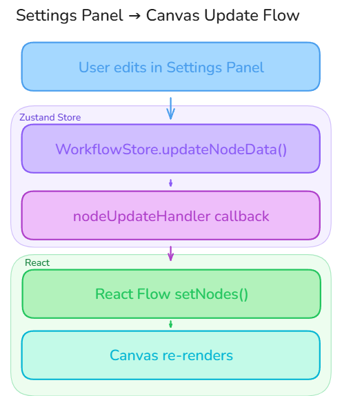

The UI is a Next.js 15 application using the App Router, React Flow for the visual canvas, Zustand for state management, and shadcn/ui for the component library.

## Project Structure

```
ui/
├── app/                          # Next.js App Router pages
│   ├── layout.tsx                # Root layout (theme provider, fonts)
│   ├── page.tsx                  # Landing page (redirects to dashboard)
│   ├── login/page.tsx            # Login page
│   ├── signup/page.tsx           # Registration page
│   ├── auth/callback/page.tsx    # OAuth callback handler
│   ├── not-found.tsx             # 404 page
│   └── dashboard/
│       ├── layout.tsx            # Dashboard layout (sidebar, topbar)
│       ├── page.tsx              # Dashboard overview (stats, recent workflows)
│       ├── workflow/
│       │   ├── page.tsx          # Workflow list
│       │   ├── new/page.tsx      # Create new workflow
│       │   └── [id]/
│       │       ├── page.tsx      # Workflow canvas editor
│       │       └── compare/page.tsx  # Version diff comparison
│       ├── clusters/
│       │   ├── page.tsx          # Cluster list
│       │   ├── new/page.tsx      # Add cluster
│       │   └── [name]/edit/page.tsx  # Edit cluster
│       ├── resources/
│       │   ├── page.tsx          # Resource list
│       │   └── [id]/page.tsx     # Resource detail (logs, terminal, status)
│       ├── build/
│       │   ├── new/page.tsx      # Start new build
│       │   └── [id]/page.tsx     # Build detail with log streaming
│       ├── integrations/
│       │   ├── page.tsx          # Integrations overview
│       │   ├── plugins/page.tsx  # Plugin marketplace
│       │   └── registries/       # Container registry management
│       ├── monitoring/           # Metrics and alerts
│       ├── settings/page.tsx     # Admin settings
│       └── profile/page.tsx      # User profile
│
├── components/
│   ├── auth/                     # Login/register forms, OAuth provider icons
│   ├── layout/                   # AppLayout, Sidebar, TopBar, Breadcrumbs
│   ├── workflow/                 # Canvas and node components (core of the app)
│   │   ├── WorkflowCanvas.tsx    # Main React Flow canvas
│   │   ├── CommandPalette.tsx    # Quick-add resource palette (Cmd+K)
│   │   ├── NodeSettingsPanel.tsx # Side panel for editing node properties
│   │   ├── WorkflowSettingsPanel.tsx # Workflow-level settings
│   │   ├── YAMLEditor.tsx        # Monaco YAML preview
│   │   ├── MiniLogsPanel.tsx     # Inline log viewer
│   │   ├── CompareCanvas.tsx     # Side-by-side version comparison
│   │   ├── ImportDialog.tsx      # Docker Compose / Git import wizard
│   │   ├── ServiceDiagnosticsPanel.tsx  # Node health diagnostics
│   │   │
│   │   ├── DeploymentNode.tsx    # Deployment node component
│   │   ├── ServiceNode.tsx       # Service node component
│   │   ├── IngressNode.tsx       # Ingress node component
│   │   ├── ConfigMapNode.tsx     # ConfigMap node component
│   │   ├── SecretNode.tsx        # Secret node component
│   │   ├── PersistentVolumeClaimNode.tsx
│   │   ├── StatefulSetNode.tsx
│   │   ├── JobNode.tsx
│   │   ├── CronJobNode.tsx
│   │   ├── DaemonSetNode.tsx
│   │   ├── HPANode.tsx
│   │   ├── NetworkPolicyNode.tsx
│   │   ├── GenericPluginNode.tsx  # Dynamic plugin node renderer
│   │   │
│   │   ├── settings/             # Per-resource-type settings editors
│   │   │   ├── DeploymentSettings.tsx
│   │   │   ├── ServiceSettings.tsx
│   │   │   ├── IngressSettings.tsx
│   │   │   ├── ConfigMapSettings.tsx
│   │   │   ├── SecretSettings.tsx
│   │   │   ├── ... (one per resource type)
│   │   │   ├── EnvVarsEditor.tsx  # Reusable env var key-value editor
│   │   │   └── VolumeClaimTemplatesEditor.tsx
│   │   │
│   │   └── version/              # Version control UI
│   │       ├── VersionHistory.tsx
│   │       ├── VersionItem.tsx
│   │       ├── CreateVersionDialog.tsx
│   │       └── RestoreConfirmDialog.tsx
│   │
│   ├── clusters/                 # Cluster auth forms
│   ├── resources/                # Log viewer, terminal (xterm.js)
│   ├── registry/                 # Registry icons
│   ├── protectedroutes/          # Auth guard components
│   ├── providers/                # Theme provider
│   └── ui/                       # shadcn/ui base components (30+ components)
│
├── stores/                       # Zustand state management
│   ├── AuthStore.ts              # Auth state (token, user, persistence)
│   ├── WorkflowStore.ts          # Canvas state (node updates, secrets, env vars)
│   ├── ClusterStore.ts           # Cluster list, selection, status
│   ├── ResourcesStore.ts         # Deployed resource tracking
│   ├── PluginStore.ts            # Plugin catalog and enablement
│   ├── RegistryStore.ts          # Container registry state
│   ├── PanelStore.ts             # UI panel widths
│   └── SidebarStore.ts           # Sidebar folder open/close state
│
├── lib/
│   ├── api.ts                    # Axios instance with JWT interceptors
│   ├── constants.ts              # Shared constants
│   ├── utils.ts                  # Utility functions (cn, etc.)
│   │
│   ├── services/                 # API service functions
│   │   ├── workflow.ts           # Workflow CRUD, versions, runs
│   │   ├── cluster.ts            # Cluster management
│   │   ├── build.ts              # Container image builds
│   │   ├── import.ts             # Import analysis and conversion
│   │   ├── plugins.ts            # Plugin operations
│   │   ├── search.ts             # Global search
│   │   └── templates.ts          # Template metadata
│   │
│   ├── hooks/                    # Custom React hooks
│   │   ├── useBuildStream.ts     # SSE hook for build log streaming
│   │   ├── useImportStream.ts    # SSE hook for import progress
│   │   ├── useLogStream.ts       # SSE hook for pod log streaming
│   │   ├── useResourceStatusStream.ts  # SSE hook for resource status
│   │   ├── useWorkflowStatusStream.ts  # SSE hook for workflow execution
│   │   └── useTerminal.ts        # xterm.js terminal hook
│   │
│   ├── types/
│   │   ├── nodes.ts              # All node data type definitions (15+ types)
│   │   ├── auth.ts               # Auth types
│   │   └── registry.ts           # Registry types
│   │
│   └── utils/
│       └── errorHandling.ts      # Centralized error handling
│
└── hooks/                        # Top-level hooks
    ├── useCluster.ts
    ├── useClusterMetrics.ts
    └── use-mobile.ts
```

## State Management Architecture

The app uses Zustand with a store-per-domain pattern. Some stores use `persist` middleware to survive page reloads via `localStorage`.

| Store | Persistence | State |
|-------|-------------|-------|
| **AuthStore** | persisted | `token`, `user`, `expiresAt` |
| **WorkflowStore** | runtime | `nodeUpdateHandler`, `secretValues`, `envValues` |
| **ClusterStore** | partial | `clusters[]`, `selectedCluster`, `clusterStatuses`, `defaultClusterId` |
| **ResourceStore** | persisted | `viewMode`, `filters` |
| **PluginStore** | runtime | `plugins[]`, `categories` |
| **RegistryStore** | runtime | `registries[]`, `defaultRegistry` |
| **PanelStore** | persisted | `widths` |
| **SidebarStore** | persisted | `folderState` |

## API Client Pattern

All API calls go through a centralized Axios instance (`lib/api.ts`) that handles:

1. **Base URL** -- Reads `NEXT_PUBLIC_API_URL` from environment
2. **JWT injection** -- Automatically attaches `Authorization: Bearer` header
3. **Token refresh** -- If token is expired, automatically calls `/auth/refresh` before retrying
4. **401 handling** -- On unauthorized response, clears auth state and redirects to `/login`
5. **Request queuing** -- Multiple requests during token refresh wait for the single refresh to complete

Service functions in `lib/services/` provide typed wrappers around the raw Axios calls.

## Workflow Canvas Architecture

The canvas is the centerpiece of the application, built on React Flow:

```
WorkflowCanvas.tsx
  ├── React Flow Provider
  │   ├── Node Types Registry (15+ types)
  │   │   ├── DeploymentNode
  │   │   ├── ServiceNode
  │   │   ├── IngressNode (multi-handle for paths)
  │   │   ├── ConfigMapNode
  │   │   ├── SecretNode
  │   │   ├── StatefulSetNode
  │   │   ├── JobNode / CronJobNode
  │   │   ├── DaemonSetNode
  │   │   ├── HPANode
  │   │   ├── NetworkPolicyNode
  │   │   ├── PersistentVolumeClaimNode
  │   │   └── GenericPluginNode
  │   │
  │   ├── Edge Connection Handler
  │   │   └── Auto-links resources (e.g., Service → Deployment, Ingress → Service)
  │   │
  │   ├── Controls + Background + MiniMap
  │   └── Auto-save (debounced)
  │
  ├── CommandPalette (Cmd+K)
  │   └── Quick-add any resource type with search
  │
  ├── NodeSettingsPanel (right sidebar)
  │   └── Per-type settings editors
  │
  └── MiniLogsPanel (bottom panel)
      └── Real-time execution logs
```

### Node Data Flow

Each node on the canvas has a `data` property matching a TypeScript interface (defined in `lib/types/nodes.ts`). When a user edits node settings:



### Secret Handling

Secret values are **never persisted** to the database. Only key names are stored. Values live transiently in the `WorkflowStore.secretValues` map and are passed directly to Kubernetes at deploy time:

```
DB stores:     { keys: [{ id, name: "DB_PASSWORD" }] }
Runtime only:  WorkflowStore.secretValues["node-1"]["DB_PASSWORD"] = "actual-value"
Deploy time:   Values sent in run request → Core → K8s Secret
```

## Real-Time Streaming Hooks

Custom hooks wrap `EventSource` (SSE) connections:

| Hook | Purpose | Stream Key |
|------|---------|------------|
| `useWorkflowStatusStream` | Node status during deployment | `workflow:<id>` |
| `useLogStream` | Live pod log streaming | `pod-logs:<id>` |
| `useResourceStatusStream` | Resource health changes | `resource:<id>` |
| `useBuildStream` | Build progress and logs | `build:<id>` |
| `useImportStream` | Import analysis progress | `import:<id>` |

Each hook returns reactive state and auto-reconnects on connection loss.
