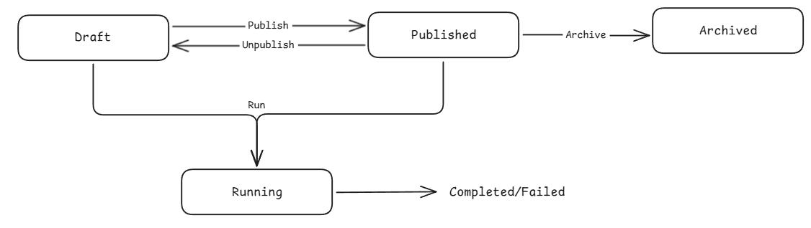

A workflow in KubeOrch represents a complete Kubernetes application topology -- the set of resources, their configurations, and the connections between them.

## Workflow States



- **Draft** -- Initial state. Workflow is being designed on the canvas.
- **Published** -- Workflow is finalized and ready for deployment.
- **Archived** -- Workflow is no longer active but preserved for reference.

## Step-by-Step Lifecycle

### 1. Create

A new workflow requires a **name** and a **target cluster**. The cluster determines where resources will be deployed.

```
POST /v1/api/workflows
{
  "name": "My Web App",
  "cluster_id": "production-cluster"
}
```

### 2. Design (Canvas)

On the visual canvas, users:

- **Add nodes** from the Command Palette (Cmd+K) or by dragging from the sidebar
- **Configure nodes** by clicking them to open the settings panel
- **Connect nodes** by drawing edges between ports (e.g., Service → Deployment, Ingress → Service)
- **Auto-save** -- changes are debounced and saved automatically

### 3. Save

Saving persists the current canvas state (nodes + edges) to the database without creating a version snapshot:

```
POST /v1/api/workflows/:id/save
{
  "nodes": [...],
  "edges": [...]
}
```

### 4. Run (Deploy)

Running a workflow:

1. **Creates a version snapshot** -- captures current nodes/edges as a numbered version
2. **Executes the workflow** -- processes each node and applies resources to Kubernetes
3. **Starts watchers** -- monitors deployed resources for status changes
4. **Streams status** -- sends real-time updates via SSE

```
POST /v1/api/workflows/:id/run
{
  "trigger_data": {}
}
```

The response includes a `run_id` for tracking the execution.

### 5. Monitor

During and after deployment, users can:

- **Watch node status** on the canvas (green = healthy, yellow = partial, red = error)
- **Stream pod logs** in the mini-logs panel or resource detail page
- **Open a terminal** into running containers via the WebSocket terminal
- **View diagnostics** for failing nodes with suggested auto-fixes

### 6. Version & Iterate

Every run creates an automatic version. Users can also create manual versions with tags and descriptions.

Key version operations:
- **List versions** -- paginated history of all versions
- **Compare versions** -- side-by-side diff showing added, removed, and modified nodes/edges
- **Restore version** -- roll back to a previous version (creates a new version from old state)

## Edge Semantics

Edges (connections between nodes) carry semantic meaning:

| Source Node | Target Node | Edge Meaning |
|------------|------------|--------------|
| Service | Deployment | Service routes traffic to this Deployment's pods |
| Ingress | Service | Ingress path forwards to this Service |
| HPA | Deployment/StatefulSet | HPA scales this workload |
| ConfigMap | Deployment/StatefulSet | ConfigMap is volume-mounted into containers |
| Secret | Deployment/StatefulSet | Secret is volume-mounted into containers |
| PVC | Deployment/StatefulSet | PVC is volume-mounted for persistent storage |
| NetworkPolicy | Any workload | Policy applies to this workload's pods |

When an edge is drawn, the UI automatically updates the linked fields in the node data (e.g., `_linkedDeployment`, `_linkedConfigMaps`).

## Run Execution Details

A workflow run tracks:

| Field | Description |
|-------|-------------|
| `status` | `running`, `completed`, `failed`, `cancelled` |
| `version` | Which version was deployed |
| `started_at` | When execution began |
| `completed_at` | When execution finished |
| `duration` | Total execution time in milliseconds |
| `node_states` | Per-node execution state and status |
| `logs` | Execution log messages |
| `triggered_by` | `manual`, `schedule`, or `webhook` |
